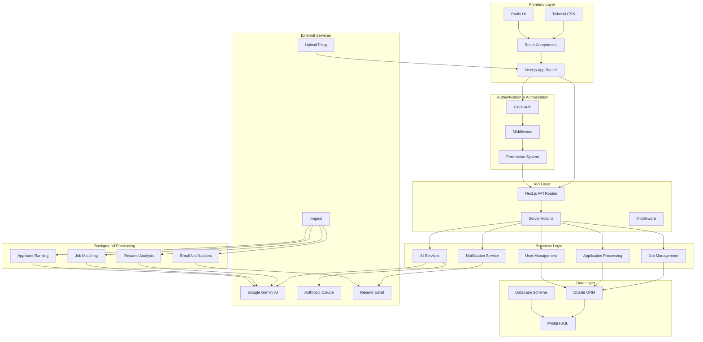

# AI Jobs - Intelligent Job Board Platform

## Overview

AI Jobs is a modern, AI-powered job board platform that revolutionizes the hiring process by leveraging artificial intelligence to match job seekers with relevant opportunities and help employers identify the best candidates. The platform provides intelligent job matching, automated applicant ranking, and comprehensive notification systems.

## Features

### 🤖 AI-Powered Job Matching
- **Intelligent Search**: AI-powered job search using natural language queries
- **Smart Matching**: Automatic matching of job seekers with relevant job listings based on skills and preferences
- **Resume Analysis**: AI-generated summaries of uploaded resumes for better matching

### 👥 Dual User Experience
- **Job Seeker Portal**: Browse jobs, apply with AI-optimized applications, receive personalized notifications
- **Employer Dashboard**: Post jobs, manage applications, track candidate ratings, and review AI-generated insights

### 📊 Advanced Application Management
- **Automated Ranking**: AI agents rank applicants based on resume and cover letter analysis
- **Application Tracking**: Multi-stage application pipeline (applied, reviewed, interviewed, etc.)
- **Rating System**: 1-5 star rating system for candidate evaluation

### 🔔 Smart Notifications
- **Daily Job Alerts**: Personalized job recommendations via email
- **Application Updates**: Real-time notifications for application status changes
- **AI-Filtered Content**: Notifications filtered by user preferences and AI analysis

### 🏢 Organization Management
- **Multi-tenant Architecture**: Support for multiple organizations
- **Role-based Permissions**: Granular access control for different user types
- **Customizable Settings**: Organization-specific notification and feature preferences

## Architecture

### System Overview
The application follows a modern microservices architecture with clear separation of concerns:

- **Frontend**: Next.js 15 with React 19, TypeScript, and Tailwind CSS
- **Backend**: Next.js API routes with server actions
- **Database**: PostgreSQL with Drizzle ORM
- **Authentication**: Clerk for user management and organization handling
- **Background Jobs**: Inngest for event-driven processing
- **AI Services**: Google Gemini and Anthropic Claude for intelligent processing
- **Email**: Resend for transactional emails
- **File Storage**: UploadThing for resume and document management

### Core Services

#### 1. Job Management Service
- **CRUD Operations**: Create, read, update, delete job listings
- **Status Management**: Draft, published, delisted states
- **Search & Filtering**: Advanced filtering by location, experience, type, etc.
- **AI Search**: Natural language job search capabilities

#### 2. Application Processing Service
- **Application Submission**: Handle job applications with cover letters
- **AI Ranking**: Automated candidate evaluation using AI agents
- **Stage Management**: Track application progress through hiring pipeline
- **Rating System**: Store and manage candidate ratings

#### 3. User Management Service
- **Profile Management**: User profiles with resume storage
- **Notification Settings**: Customizable email preferences
- **Organization Membership**: Multi-organization support
- **Permission System**: Role-based access control

#### 4. AI Processing Service
- **Resume Analysis**: Extract skills and qualifications from resumes
- **Job Matching**: Match candidates with relevant job opportunities
- **Applicant Ranking**: Evaluate candidates against job requirements
- **Content Generation**: AI-powered email content and summaries

#### 5. Notification Service
- **Email Templates**: React-based email components
- **Scheduled Jobs**: Daily notification processing
- **AI Filtering**: Smart content filtering based on user preferences
- **Multi-channel**: Email and in-app notifications

## Block Diagram



## Technology Stack

### Frontend
- **Next.js 15**: React framework with App Router
- **React 19**: Latest React with concurrent features
- **TypeScript**: Type-safe development
- **Tailwind CSS**: Utility-first CSS framework
- **Radix UI**: Accessible component primitives
- **Lucide React**: Icon library
- **React Hook Form**: Form management
- **Zod**: Schema validation

### Backend
- **Next.js API Routes**: Server-side API endpoints
- **Server Actions**: Type-safe server functions
- **Drizzle ORM**: Type-safe database queries
- **PostgreSQL**: Primary database
- **Clerk**: Authentication and user management

### AI & Processing
- **Google Gemini 2.0**: AI model for job matching and ranking
- **Anthropic Claude**: AI model for resume analysis
- **Inngest**: Background job processing
- **Agent Kit**: AI agent framework

### Infrastructure
- **Docker**: Containerization
- **UploadThing**: File storage and management
- **Resend**: Email delivery service
- **T3 Env**: Environment variable validation

## Installation

### Prerequisites
- Node.js 18+ 
- PostgreSQL 17+
- Docker (optional)

### Environment Variables
Create a `.env.local` file with the following variables:

```env
# Database
DB_HOST=localhost
DB_PORT=5432
DB_NAME=ai_jobs
DB_USER=your_db_user
DB_PASSWORD=your_db_password

# Authentication
CLERK_SECRET_KEY=your_clerk_secret_key
CLERK_WEBHOOK_SECRET=your_clerk_webhook_secret

# AI Services
ANTHROPIC_API_KEY=your_anthropic_api_key
GEMINI_API_KEY=your_gemini_api_key

# External Services
UPLOADTHING_TOKEN=your_uploadthing_token
RESEND_API_KEY=your_resend_api_key
SERVER_URL=http://localhost:3000
```

### Setup Instructions

1. **Clone the repository**
   ```bash
   git clone <repository-url>
   cd ai-jobs
   ```

2. **Install dependencies**
   ```bash
   npm install
   ```

3. **Set up the database**
   ```bash
   # Using Docker
   docker-compose up -d
   
   # Or set up PostgreSQL manually
   # Then run migrations
   npm run db:push
   ```

4. **Start the development server**
   ```bash
   npm run dev
   ```

5. **Start background job processing**
   ```bash
   npm run inngest
   ```

6. **Start email development server** (optional)
   ```bash
   npm run email
   ```

## Usage

### For Job Seekers

1. **Sign Up**: Create an account using Clerk authentication
2. **Upload Resume**: Upload your resume for AI analysis
3. **Browse Jobs**: Use the AI search to find relevant opportunities
4. **Apply**: Submit applications with cover letters
5. **Track Applications**: Monitor application status and ratings

### For Employers

1. **Create Organization**: Set up your company profile
2. **Post Jobs**: Create detailed job listings
3. **Review Applications**: View and manage incoming applications
4. **AI Insights**: Get AI-generated candidate rankings
5. **Manage Pipeline**: Track candidates through hiring stages

### AI Features

- **Smart Job Search**: Describe what you're looking for in natural language
- **Resume Analysis**: Automatic extraction of skills and experience
- **Candidate Ranking**: AI-powered evaluation of job fit
- **Personalized Notifications**: Tailored job recommendations

## Project Structure

```
src/
├── app/                          # Next.js App Router
│   ├── (clerk)/                 # Authentication routes
│   ├── (job-seeker)/           # Job seeker interface
│   ├── employer/               # Employer interface
│   └── api/                    # API routes
├── components/                  # Reusable UI components
│   ├── ui/                     # Base UI components
│   ├── sidebar/                # Sidebar components
│   └── markdown/               # Markdown editor
├── features/                    # Feature modules
│   ├── jobListings/            # Job listing management
│   ├── jobListingApplications/ # Application processing
│   ├── organizations/          # Organization management
│   └── users/                  # User management
├── services/                    # External service integrations
│   ├── clerk/                  # Authentication service
│   ├── inngest/                # Background job processing
│   ├── resend/                 # Email service
│   └── uploadthing/            # File storage
├── drizzle/                     # Database schema and migrations
├── hooks/                       # Custom React hooks
└── lib/                        # Utility functions
```

## Design Principles & Patterns

> 📋 **Detailed Analysis**: For a comprehensive technical analysis of the codebase architecture, design patterns, and code quality assessment, see [ARCHITECTURE_ANALYSIS.md](./ARCHITECTURE_ANALYSIS.md)

### SOLID Principles Implementation

#### Single Responsibility Principle (SRP)
- **Feature Modules**: Each feature (`jobListings`, `jobListingApplications`, etc.) has a single responsibility
- **Service Separation**: Clear separation between authentication, email, AI, and file storage services
- **Component Isolation**: UI components have focused, single purposes

#### Open/Closed Principle (OCP)
- **Plugin Architecture**: AI agents can be extended without modifying core logic
- **Strategy Pattern**: Different AI models can be swapped via configuration
- **Component Composition**: UI components are designed for extension through props

#### Liskov Substitution Principle (LSP)
- **Interface Consistency**: All AI agents implement the same interface
- **Database Abstraction**: Drizzle ORM provides consistent database access patterns
- **Component Props**: React components accept consistent prop interfaces

#### Interface Segregation Principle (ISP)
- **Focused Interfaces**: Separate interfaces for different concerns (auth, notifications, etc.)
- **Component Props**: Components only receive props they actually use
- **Service APIs**: Each service has a focused, minimal API

#### Dependency Inversion Principle (DIP)
- **Service Injection**: Services are injected rather than directly instantiated
- **Abstraction Layers**: Database access through ORM abstraction
- **Environment Configuration**: External dependencies configured through environment variables

### Design Patterns Used

#### Creational Patterns
- **Factory Pattern**: AI agent creation and configuration
- **Builder Pattern**: Complex query building in Drizzle ORM
- **Singleton Pattern**: Service clients (Resend, UploadThing)

#### Structural Patterns
- **Adapter Pattern**: Integration with external services (Clerk, AI providers)
- **Facade Pattern**: Simplified interfaces for complex subsystems
- **Decorator Pattern**: Component enhancement and styling

#### Behavioral Patterns
- **Observer Pattern**: Event-driven architecture with Inngest
- **Strategy Pattern**: Different AI models and processing strategies
- **Command Pattern**: Server actions and background job processing
- **Template Method Pattern**: Consistent processing pipelines

#### Architectural Patterns
- **Repository Pattern**: Data access abstraction through Drizzle
- **Service Layer Pattern**: Business logic separation
- **Event-Driven Architecture**: Asynchronous processing with Inngest
- **CQRS**: Separation of read and write operations

## API Documentation

### Job Listings API

#### GET `/api/job-listings`
Retrieve job listings with filtering and pagination.

**Query Parameters:**
- `search`: Search term
- `location`: Location filter
- `experienceLevel`: Experience level filter
- `type`: Job type filter
- `page`: Page number
- `limit`: Results per page

#### POST `/api/job-listings`
Create a new job listing (employer only).

**Request Body:**
```json
{
  "title": "Software Engineer",
  "description": "Job description...",
  "wage": 80000,
  "wageInterval": "yearly",
  "locationRequirement": "remote",
  "experienceLevel": "mid-level",
  "type": "full-time"
}
```

### Applications API

#### POST `/api/applications`
Submit a job application.

**Request Body:**
```json
{
  "jobListingId": "uuid",
  "coverLetter": "Cover letter text..."
}
```

#### PUT `/api/applications/{applicationId}/stage`
Update application stage (employer only).

**Request Body:**
```json
{
  "stage": "interviewed"
}
```

### AI Search API

#### POST `/api/ai-search`
Perform AI-powered job search.

**Request Body:**
```json
{
  "prompt": "Looking for remote React developer positions"
}
```

## Contributing

1. Fork the repository
2. Create a feature branch (`git checkout -b feature/amazing-feature`)
3. Commit your changes (`git commit -m 'Add some amazing feature'`)
4. Push to the branch (`git push origin feature/amazing-feature`)
5. Open a Pull Request

### Development Guidelines

- Follow TypeScript best practices
- Use conventional commit messages
- Write tests for new features
- Update documentation as needed
- Follow the existing code style and patterns

## License

This project is licensed under the MIT License - see the [LICENSE](LICENSE) file for details.

## Support

For support and questions:
- Create an issue in the repository
- Check the documentation
- Review existing discussions

---

Built with ❤️ using Next.js, TypeScript, and AI
